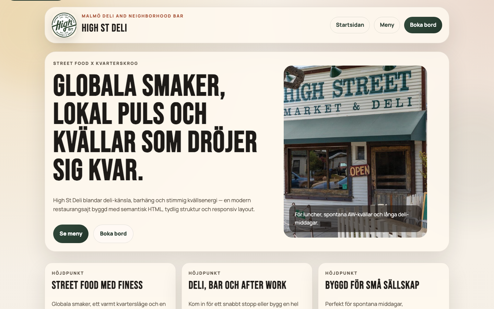
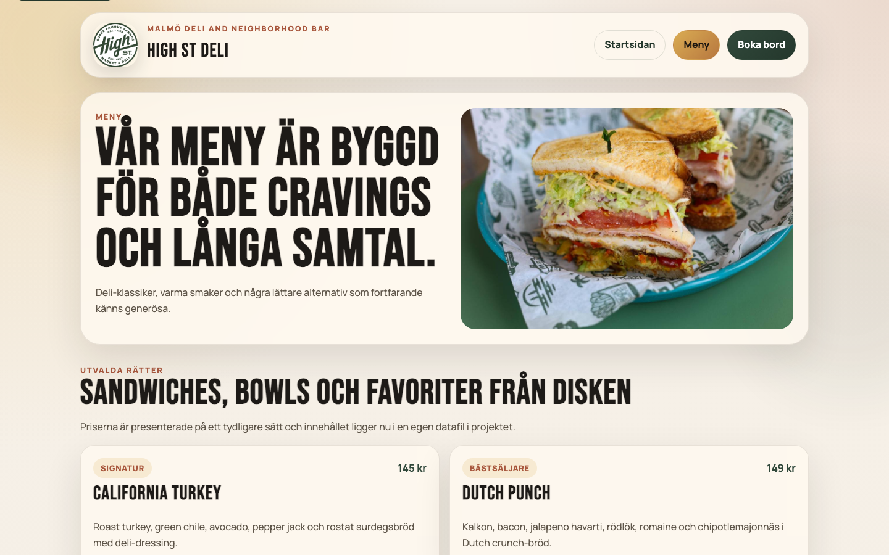
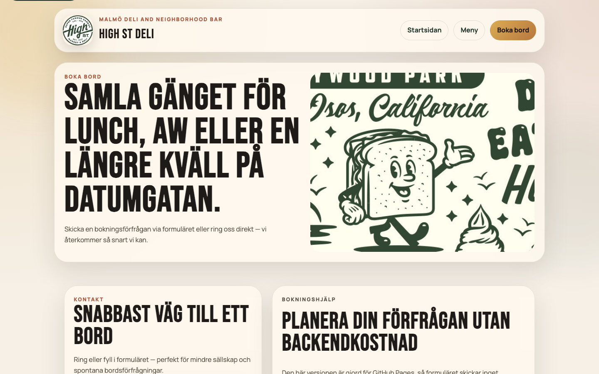

# High Street Deli Website


Responsive marketing website for **High St Deli** — a neighborhood deli and bar in Malmö. Built with semantic HTML, custom CSS, and Astro for static generation and shared layouts.

**Live demo:** [high-street-deli-website.netlify.app](https://high-street-deli-website.netlify.app)

## Highlights

- Semantic page structure with accessible navigation, skip links, and clear heading hierarchy
- Responsive layout for home, menu, and table booking flows
- Content-driven menu data separated from presentation
- Static Astro build deployed on Netlify (no backend required)
- Mobile-friendly booking form with contact details and opening hours

## Screenshots

| Home | Menu | Booking |
|------|------|---------|
|  |  |  |

## Tech stack

| Layer | Choice |
|-------|--------|
| Framework | Astro 6 (static output) |
| Language | TypeScript |
| Styling | Custom CSS |
| Hosting | Netlify |

## Local development

```bash
git clone https://github.com/Elli2022/high-street-deli-website.git
cd high-street-deli-website
npm install
npm run dev
```

Open http://127.0.0.1:4321

### Build & preview

```bash
npm run build
npm run preview
```

### Screenshots (optional)

```bash
npx playwright install chromium
npm run build && npm run preview -- --port 4321
SCREENSHOT_BASE_URL=http://127.0.0.1:4321 npm run screenshots
```

## Project structure

```text
src/
  components/   # Header, footer, booking form, section blocks
  data/         # Menu items and site content
  layouts/      # Shared page shell
  pages/        # Home, menu, booking routes
  styles/       # Global CSS
public/
  images/       # Restaurant photography
  screenshots/  # README visuals
```

## For reviewers / interviews

1. **Semantic HTML:** Landmarks, headings, and forms are structured for accessibility and maintainability.
2. **Static-first:** Astro generates plain HTML/CSS — fast, cheap to host, easy to reason about.
3. **Content separation:** Menu items live in data files; pages focus on layout and UX.
4. **Tradeoff:** No live booking backend — appropriate for a portfolio demo; production would connect to email or a reservation API.

## License

ISC
